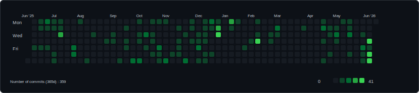
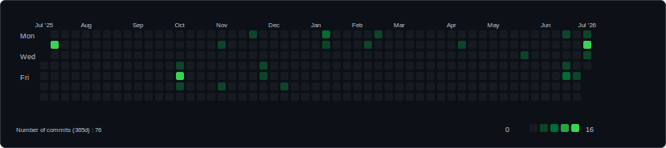

# Hi there, I'm Louis 👋

Welcome to my GitHub profile!

## 🛠️ Tech Stack

### Languages & Technologies

## 📈 Contribution Graph

Most of my day-to-day work lives in **private GitLab** repositories, so what you see on GitHub is only part of the picture. The graphs below cover **GitHub** and **GitLab** over the **last 365 days**.

### GitHub Activity

<!-- github-metrics:start -->
**GitHub:** run `python github-stats.py` (with `GH_TOKEN`) or wait for CI to refresh these numbers.
<!-- github-metrics:end -->

### GitLab Activity

<!-- gitlab-metrics:start -->
**GitLab:** run `python gitlab-activity.py` (with `GITLAB_TOKEN`) or wait for CI to refresh these numbers.
<!-- gitlab-metrics:end -->

## 🤝 Connect With Me

